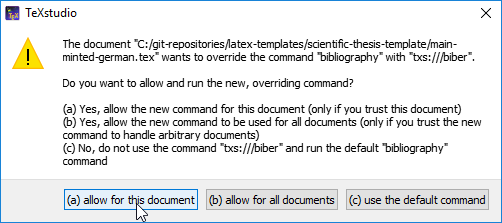
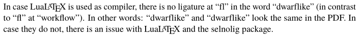
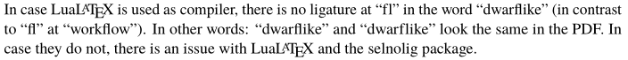

# LaTeX Template for Scientific Theses [](https://github.com/latextemplates/scientific-thesis-template/actions?query=workflow%3A%22Build+with+lualatex%22)

This template is a general template for scientific theses.
Currently, it is the unofficial LaTeX template for Master, Bachelor, Diploma, and Student Theses at following institutions:

- University of Stuttgart, Computer Science
  - [English example](https://latextemplates.github.io/scientific-thesis-template/main-english.pdf)
  - [German example](https://latextemplates.github.io/scientific-thesis-template/main-german.pdf)
  - [German example with minted and PlantUML](https://latextemplates.github.io/scientific-thesis-template/main-minted-german.pdf)
- Paderborn University, Computer Science - to be confirmed.
  - [English example](https://latextemplates.github.io/scientific-thesis-template/main-paderborn-english.pdf)
  - [German example](https://latextemplates.github.io/scientific-thesis-template/main-paderborn-german.pdf)

The template will be extended to support theses from different institutions.

For [architectural decision records](https://adr.github.io) see [docs/adr](https://latextemplates.github.io/scientific-thesis-template/adr/).

<!-- toc -->

- [Characteristics of the template](#characteristics-of-the-template)
- [Quick start](#quick-start)
- [Recommended LaTeX environments](#recommended-latex-environments)
- [Installation hints for Ubuntu](#installation-hints-for-ubuntu)
- [Installation hints for Windows](#installation-hints-for-windows)
- [LaTeX compilation](#latex-compilation)
- [FAQ](#faq)
- [Contained Files and Directories](#contained-files-and-directories)
- [Resources](#resources)
- [License](#license)

<!-- tocstop -->

## Characteristics of the template

- Most recent packages and package configuration based on long-time experience.
- ~~[lualatex](http://www.luatex.org/) to enable proper typeset [ligatures](https://en.wikipedia.org/wiki/Typographic_ligature).~~
  For older systems, [pdflatex](https://en.wikipedia.org/wiki/PdfTeX) is still supported.
- Open for contributions.
- [latexmk] - Reasoning available at <https://tex.stackexchange.com/a/249243/9075>.
- [biblatex]+[biber] instead of plain [bibtex], because biblatex fully supports UTF-8 and commands such as `\citeauthor{...}` work out of the box. See also <https://tex.stackexchange.com/q/8411/9075>.
- ~~Automatic adjustment of wrong [ligatures](https://en.wikipedia.org/wiki/Typographic_ligature) using the [selnolig](https://tex.meta.stackexchange.com/questions/2884/new-package-selnolig-that-automates-suppression-of-typographic-ligatures) package~~
- Full Unicode (UTF-8) support
- Optional: Render listings using [minted](https://github.com/gpoore/minted/), which provides better output than [listings](https://ctan.org/pkg/listings), but requires [pygments](http://pygments.org/) to be installed.
- Optional: Direct inclusion of [PlantUML](http://plantuml.com/) diagram.s

Even though AuToLaTeX is [more powerful than latexmk](http://www.arakhne.org/autolatex/), it is [not included in MiKTeX](http://www.ctan.org/pkg/autolatex) and therefore it is not used here.

## Quick start

1. Download
    1. Go to the development version at <https://github.com/latextemplates/scientific-thesis-template/archive/main.zip>. Reason: LaTeX packages change so fast over time and we cannot do a release on each change.
    2. Extract `scientific-thesis-template-main.zip` to the directory you want to work. E.g., `c:\users\user\documents\thesis`.
2. Start texing
    - University of Stuttgart:
        - English: `main-english.tex`
        - German: `main-german.tex`
        - German advanced usage: `main-minted-german.tex` (see below)
    - Paderborn University:
        - Start texing at `main-paderborn-english.tex` or `main-paderborn-german.tex`.
        - Adapt `logos/UBP-background-picture.pdf` to your needs. It has the format 20cm x 10cm.
        - Change `!TeX root =` in `latexhints-english.tex` and `latexhints-german.tex`.

### Usage at overleaf

See [overleaf](overleaf.md).

### Usage using plain git

We do not recommend to fork this project as a fork denotes that you work on improving the template itself.
Thus, just create a new git repository and populate it using the files provided at `scientific-thesis-template-<VERSION>.zip`, which you downloaded at the [latest release page](https://github.com/latextemplates/scientific-thesis-template/releases/latest).

## Recommended LaTeX environments

### Offline usage

Grammar and spell checking is available at [TeXstudio].
Please download [LanguageTool] and [configure TeXstudio to use it](http://wiki.languagetool.org/checking-la-tex-with-languagetool#toc4).
Note that it is enough to point to `languagetool-server.jar`.


Use [JabRef] to manage your bibliography.
Quick installation using [Chocolatey]: `choco install texstudio languagetool jabref`.

A comparison to other literature management software is available at <https://ultimate-comparisons.github.io/ultimate-reference-management-software-comparison/>.
See [LaTeX Editors/IDEs question on TeX.SX](http://tex.stackexchange.com/questions/339/latex-editors-ides) for a complete list of LaTeX editors.

### Online usage

[overleaf] has been tesed by multiple users.
It also comes with [git support](https://www.overleaf.com/blog/195-new-collaborate-online-and-offline-with-overleaf-and-git-beta#.VYFC2UZejkU).

## Installation hints for Ubuntu

- From Ubuntu 18.10 onwards, the basic version of the template works without issues.
  Advanced usages such as cool syntax highlighting with [minted](https://www.ctan.org/pkg/minted) needs more configuration.
- Ubuntu 16.04 [ships biber 2.4](https://bugs.launchpad.net/ubuntu/+source/biber/+bug/1589644), so you have to upgrade your texlive distribution.
  The easiest way is to uninstall the ubuntu package and use [install-tl-ubuntu](https://github.com/scottkosty/install-tl-ubuntu).
  Then, you can follow the instructions given at <http://tex.stackexchange.com/a/55459/9075> to update your texlive distribution.
  If you do not want to have an updated installation, but fiddle around with dirty patching your installation, please follow  <http://tex.stackexchange.com/questions/84624/how-to-upgrade-biblatex-properly>.

Always working solution: Use the [docker image](https://hub.docker.com/r/danteev/texlive/).
This is provides a perfectly configured latex distribution with all required tools.

1. Execute `sudo visudo` to edit the sudoers file
1. Add the line `myusername ALL = (root) NOPASSWD: /usr/bin/docker`. Replace `myusername` accordingly. (Source: <https://unix.stackexchange.com/a/13058/18033>)
1. Execute `sudo docker pull danteev/texlive`.
   This should not ask for any password.
   Will download approx. 4GB.
1. Open TeXstudio
1. Options > Configure TeXstudio > Commands
1. Set "PdfLaTeX" to `docker run --rm -v DIROFTEXDOCUMENT:DIROFTEXDOCUMENT --workdir=DIROFTEXDOCUMENT danteev/texlive pdflatex --shell-escape -synctex=1 -interaction=nonstopmode %.tex`, replace `DIROFTEXDOCUMENT` by the directory of your latex document. Example: `/home/user/thesis`.
1. Set "LuaLaTeX" to `docker run --rm -v DIROFTEXDOCUMENT:DIROFTEXDOCUMENT --workdir=DIROFTEXDOCUMENT danteev/texlive lualatex --shell-escape -synctex=1 -interaction=nonstopmode %.tex`, replace `DIROFTEXDOCUMENT` by the directory of your latex document. Example: `/home/user/thesis`.
1. Set "Biber" to `docker run --rm -v DIROFTEXDOCUMENT:DIROFTEXDOCUMENT --workdir=DIROFTEXDOCUMENT danteev/texlive biber %`, replace `DIROFTEXDOCUMENT` by the directory of your latex document. Example: `/home/user/thesis`.
1. Check if the "docker pull" command from step 3 succeed. If not, wait.
1. Try to press the "Compile" (<kbd>F6</kbd>) button in TeXstudio.

## Installation hints for Windows

Note: The default installation of MiKTeX might ship with incompatible biblatex and biber packages.
**You have to keep your MiKTeX up to date.**
In case you followed the linked installation steps, you only have to run "Update MiKTeX".
If you installed MiKTeX other ways, you have to run "Update MiKTeX (Admin)" and "Update MiKTeX" and check in both tools for updates (see <http://tex.stackexchange.com/a/108490/9075>).
  
### Preparations

1. Install [chocolatey]:
    1. Open `cmd.exe` as Administartor
    2. Paste and hit <kbd>Enter</kbd> `@"%SystemRoot%\System32\WindowsPowerShell\v1.0\powershell.exe" -NoProfile -InputFormat None -ExecutionPolicy Bypass -Command "iex ((New-Object System.Net.WebClient).DownloadString('https://chocolatey.org/install.ps1'))" && SET "PATH=%PATH%;%ALLUSERSPROFILE%\chocolatey\bin"`
1. Execute `choco feature enable -n=allowGlobalConfirmation` to get rid off additional installation confirmations.
1. Execute `choco install texstudio sumatrapdf.install strawberryperl jre8 jabref languagetool` to install necessary tooling.
1. In case [PlantUML](http://plantuml.com/) should be used, follow the installation instructions at <https://koppor.github.io/plantuml/> listed at the "pre-conditions" section.
1. For more recommended tooling see <https://github.com/koppor/koppors-chocolatey-scripts>.

### Recommended setup of MiKTeX

1. Download the basic installer from <http://miktex.org/download>
1. Start it
1. First screen: Read the license conditions and be sure that you really agree.
    - Check "I accept the MiKTeX copying conditions"
    - Click "Next"
1. Second screen: "Shared Installation": Install MiKTeX for: "Only for: `username`".
    - Check first option
    - Click "Next"
1. Third screen: "Installation Directory": Install MiKTeX to: `C:\MiKTeX`. This enabled browsing for documentation at `C:\MiKTeX29\doc\latex`
    - Input "C:\MiKTeX" in the input field
    - Click "Next"
1. Fourth screen: "Settings": Preferred paper: A4 and install missing packages on the fly.
    - First combo box: "A4"
    - Second combo box: "Yes":
    - Click "Next"
1. Fifth screen: Press "Start"
1. Now a window "Executing" appears. It will take about 5 minutes until this is finished.
1. At the last screen: Click "Close"
1. After the installation:
     1. Open `cmd.exe`
     2. Execute `refreshenv` to make MiKTeX's binaries known right after the installation
     3. Execute `mpm --update-db`
     4. Execute `mpm --update`
     5. Execute `mpm --install=tex-gyre` (to resolve `fontspec error: "font-not-found"`, `\setmainfont{TeX Gyre Termes}`)
     6. Execute `mpm --install=tex-gyre-math`
     7. Execute `mpm --install=cm-super`
     8. Execute `initexmf --update-fndb` (ensure that no other MiKTeX tooling such as the [MiKTeX Console](https://miktex.org/howto/miktex-console) is run in parallel - see <https://github.com/MiKTeX/miktex/issues/98#issuecomment-375952270>)
     9. Execute `initexmf --mklinks --force`

# Using VSCode to Edit, Compile, and Preview PDFs
***Note: The configuration of LaTeX Workshop on [Fast Guide on Writing LaTeX with LaTeX Workshop in VS Code](https://mathjiajia.github.io/vscode-and-latex/) may require some modifications to work with this template.***

## Prerequisites
1. Install [VSCode](https://code.visualstudio.com/).
2. Install [LaTeX Workshop](https://marketplace.visualstudio.com/items?itemName=James-Yu.latex-workshop).
3. Install a LaTeX distribution (e.g., [MiKTeX](https://miktex.org/download) or [TeX Live](https://www.tug.org/texlive/)).

## Recommended Setup of VSCode
1. Open VSCode.
2. Press <kbd>Shift</kbd>+<kbd>Ctrl</kbd>+<kbd>P</kbd> to open the command palette. Then type "JSON" and select "Preferences: Open Settings (JSON)" to open `settings.json`.
3. Now copy and paste the following two snippets into your `settings.json` file (inside the brackets `{}` of your file).

```json
"latex-workshop.latex.tools": [
  {
    "name": "pdflatex",
    "command": "pdflatex",
    "args": [
      "-synctex=1",
      "-interaction=nonstopmode",
      "-file-line-error",
      "%DOC%"
    ],
    "env": {}
  },
  {
    "name": "biber",
    "command": "biber",
    "args": [
      "%DOCFILE%"
    ],
    "env": {}
  }
],

"latex-workshop.latex.recipes": [
  {
    "name": "pdflatex ➞ biber ➞ pdflatexX2",
    "tools": [
      "pdflatex",
      "biber",
      "pdflatex",
      "pdflatex"
    ]
  }
],
```
4. (optional) if you add the folwing line into your `settings.json`, the LaTeX Workshop extension will not automatically compile the code after any changes. You can manually trigger compilation by hitting the green button in the extension or using other methods provided by LaTeX Workshop.
```json
  "latex-workshop.latex.autoBuild.run": "never",    
```
## LaTeX compilation

The template is compiled using normal compilation commands.
Your LaTeX environment (such as [TeXStudio]) should take care about the compilation transparently.

If you open `main-minted-german.tex`, there will be a warning that the compilation command will be overridden.
Please answer `(a) allow for this document`:


At "Build & View", there will be a question to update to biber.
Please answer `(a) allow for this document`:



When the "Package Installation" dialog pops up at TeXStudio, choose your username at "The package will be installed for:" and uncheck "Always show this dialog before installing packages."
If you want to include .svg graphics, [inkscape] has to be in your path.

**Attention!** The first compilation will take **at least 30 seconds**, because there will be some LaTeX packages installed.

### Using the command line

For debugging, it might be better to use the command line for latexing.
Use `lualatex --shell-escape main-minted-german` to compile the main document.
Run `biber main-minted-german` to get the bibliography rendered (execute `lualatex` afterwards).

Automatic compilation is also possible:

    latexmk main-german

If you want automatic compilation use following command:

    latexmk -pvc main-german

This will also open a [Sumatra PDF] and only works with the supplied configuration.

### latexmk configuration

This repository ships a `.latexmk` which is read by latexmk.
It is configured for Windows and especially sets Sumatra PDF as default PDF viewer.
You can make this local configuration a global configuration, when you put it at [the right place](http://tex.stackexchange.com/a/41149/9075).

If you want to add more packages, configure it there.
For instance, for support of makeglossaries see <http://tex.stackexchange.com/questions/1226/how-to-make-latexmk-use-makeglossaries>.

## FAQ

### Q: What is the issue with ligatures?

A [ligature](https://en.wikipedia.org/wiki/Typographic_ligature) is the joining of letters to look better.
There are rules that there should be no ligatures at "morpheme boundaries".
See [english.stackexchange.com](https://english.stackexchange.com/q/50660/66058) for a long discusisson.

Example with correct ligatures:



Example with wrong ligatures:



See [ADR-0004](docs/adr/0004-use-lualatex-for-correct-ligatures.md) for a discussion on the technical solution possiblities.

### Q: There is an output that biber/biblatex too old

See installation hints of how to update them at different systems.

### Q: Overleaf complains about missing `.sty` files.

Google for the name of the `sty` and upload it to overleaf.
As of 2018-02-17, these are:

- `lccaps.sty` - can be downloaded from <https://latextemplates.github.io/stys-for-overleaf/>.
- `scientific-thesis-cover.sty` - can be downloaded from <https://raw.githubusercontent.com/latextemplates/scientific-thesis-cover/master/scientific-thesis-cover.sty>.

### Q: MiKTeX complains about missing `.sty` files.

Use the [MiKTeX console](https://miktex.org/howto/miktex-console) to refresh the package index.
Then, automatic installation should work again.

### Q: I cannot get minted to run. There is this `-shell-escape` warning.

Please ensure that your compiliation command includes `-shell-escape`.
E.g., `lualatex -shell-escape -synctex=1 main-minted-german.tex`.
When compiling `main-minted-german.tex` with TeXStudio, you will see a dialog warning about overriding the comipiliation command.
Just anser "(a) allow for this document" and it will work.

### Q: My Paderborn title page is strange. The boxes seem to be located arbitrarily.

Just run pdflatex again.

### Q: I get the error  `! pdfTeX error (font expansion): auto expansion is only possible with scalable fonts.`

Install the `cm-super` package using the MiKTeX package manager. Then, run `initexmf --mkmaps` on the command line. (Long description: <http://tex.stackexchange.com/a/324972/9075>)

### Q: How do I change the appearance of chapter headings?

Edit `preambel/chapterheads.tex`.

### Q: How to include Excel charts properly?

1. Select the excel chart you want to use.
2. Print to PDF with the option "Print Selected Chart".
3. Remove empty space of the created PDF page with `pdfcrop chart.pdf chart_cropped.pdf` (install via MikTex first, if not available; check via `pdfcrop --version`).
4. Use pdfscissors (https://sites.google.com/site/pdfscissors) to crop the borders and title (maybe you have to allow <https://sites.google.com> in the Java security center in the control panel).
5. Include the PDF in LaTex via `\includegraphics{chart_cropped.pdf}`.

### Q: Do I need to take special care because of Visual Studio Code?

Please remove the magic comments (`% !TeX program ...`) at the top of the `main-....tex` file.
Although [LaTeX-Workshop supports magic comments](https://github.com/James-Yu/LaTeX-Workshop/blob/master/README.md#magic-comments), it currently does not work reliably.
Without the magic comments, compilation works.

### Q: Do I have to do something special for the final version?

- If you included some version control statements, please remove them. Currently, the template does not support any, but it used to support SVN.
- By using `\largepage` and `\shortpage`, single lines at the bottom or at the top of the page can be manually fixed.
- Search the PDF for "TODO" or similar things. Remove `\usepackage{todonotes}` in `config.tex`.
- Ensure that you run `lualatex` at least three times and that there are no "undefined references".
- The margins are intended for good screen reading. **Do not change them** (or do exactly know what you are doing).

### Q: I want to use make instead of latexmk

For those, who have [cygwin](http://www.cygwin.com/) installed or run a linux machine, this template offers a simple LaTeX makefile.
It is not as sophisticated as other projects, but does its job.

    make

Make targets:

- `pdf` (default): Generates ausarbeitung.pdf
- `aspell`: Checks all files using aspell.
- `clean`: Removes all temporary files.
- `mrproper`: Cleans up and removes also editor backup files.
- `stand`: Creates a new PDF with the current status of the thesis.
- `view`: Opens the configured viewer
- `6`: Generates a 3x2 postscriptfile using psnup.

### Q: Are there any other alternatives to latexmk and make?

* <https://github.com/akerbos/ltx2any>
* <https://github.com/shiblon/latex-makefile>
* <https://github.com/ransford/pdflatex-makefile>
* <https://github.com/brotchie/latex-rubber-makefile>
* [LaTeX-Mk](http://latex-mk.sourceforge.net/)
* See also [Recommended build system for latex?](https://stackoverflow.com/q/1240037/873282) and [How to properly 'make' a latex project?](https://tex.stackexchange.com/q/40738/9075)

### Q: I want to use minted as its syntax highlighting seems to be better

1. Install python and [pygments](http://pygments.org/):
  - `choco install python`
  - `pip install pygments`
1. Start with `main-minted-german.tex`
2. Use `-shell-escape` when texing: `lualatex -shell-escape main-minted-german.tex`

### Q: `main-minted-german.tex` does not compile: ``File `main-minted-german-plantuml.latex' not found. \end{plantuml}``. What can I do?

You did not setup the [plantuml package](https://www.ctan.org/pkg/plantuml) correctly.
Please head to <https://koppor.github.io/plantuml/> for installation instructions.

### Q: Is there any other place to look for further information?

For German users, go to <http://texfragen.de/>.

### Q: I was recommended the Harvard style

This template uses the alphabetic style.
That style is explained at the [biblatex documentation](http://texdoc.net/texmf-dist/doc/latex/biblatex/biblatex.pdf) on page 60:

> The alphabetic labels resemble a compact author-year
> style to some extent, but the way they are employed is similar to a numeric citation
> scheme. For example, instead of “Jones 1995” this style would use the label “[Jon95]”.
> “Jones and Williams 1986” would be rendered as “[JW86]”.

We are aware that the University of Stuttgart [recommends to use the Hardvard style](https://ilias3.uni-stuttgart.de/ilias.php?ref_id=12257&from_page=11895&obj_id=11896&cmd=layout&cmdClass=illmpresentationgui&cmdNode=dn&baseClass=ilLMPresentationGUI).
However, this style is not common in natural sciences and information science.

### Q: How can I reformat my .tex files?

Execute `latexindent -l -s -sl -w main-english.tex`

### Q: How I want to obey the one-sentence-per-line rule.

Execute `latexindent -m -l -s -sl -w main-english.tex`.
Attention! This is work in progress and does not always produce best results.

### Q: Aren't there other templates?

Sure. The [Hagenberg Thesis Document Collection](https://github.com/Digital-Media/HagenbergThesis) seems to be the most promising.
However, they currently do not support microtype and not the cover of the University of Stuttgart.

We are collecting alternatives at the issue [#25](https://github.com/latextemplates/scientific-thesis-template/issues/25) and plan to add a comparison to each other template.

### Q: I get `Font "LatinModernMath-Regular" not found.`. What can I do?

Error message:

```text
luaotfload | db : Reload initiated (formats: otf,ttf,ttc); reason: Font "LatinModernMath-Regular" not found.
luaotfload | resolve : sequence of 3 lookups yielded nothing appropriate.

! Package fontspec Error: The font "LatinModernMath-Regular" cannot be found.
```

Install the package `lm-math` manually.

### Q: I get `! Package fontspec Error: The font "LinuxLibertineO" cannot be found.`. What can I do?

Install the package `libertine` manually.

### Q: I get `! Package fontspec Error: The font "TeXGyreTermes" cannot be found.`. What can I do?

Install the package `tex-gyre` and `tex-gyre-math` manually.

### Q: I get `! error:  (type 1): cannot find encoding file 'ntx-ot1-tlf.enc' for reading`. What can I do?

See <https://tex.stackexchange.com/a/240850/9075>: Install the packages `newpx` and `newtxsf` manually.

### Q: I get `! TeX capacity exceeded, sorry [main memory size=3000000].`. What can I do?

Follow the steps at <https://tex.stackexchange.com/a/548335/9075>

Try with following command

     pdflatex -shell-escape --extra-mem-top=10000000 --synctex=1 main-german.tex

See <https://tex.stackexchange.com/a/124206/9075> for details.

### Q: I get `Unknown pattern ngerman-x-latest`. What can I do?

On MiKTeX, one can solve it as follows:

1. Disable `\RequirePackage[ngerman=ngerman-x-latest]{hyphsubst}`
2. Compile the document. This way, miktex downloads additional packages. Including `hyphsubst`.
3. Enable `\RequirePackage[ngerman=ngerman-x-latest]{hyphsubst}`

## Contained Files and Directories

### Directories

- [graphics](graphics/) Directory containing the figures.
  By using LuaLaTex/PDFLaTeX it is possible to use PDFs, JPGs, PNGs, ... We recommend to use PDFs to enable smooth scaling.

### Files

- `main-*.tex` - Start file for theses
  - The files follow the pattern `main-[institution-][feature-][language].tex`, where
    - `institution` is empty or `paderborn`
    - `feature` is empty or `minted`
    - `language` is `english` or `german`
    - [main-german.tex](https://github.com/latextemplates/scientific-thesis-template/blob/master/main-german.tex) for German
    - [main-english.tex](https://github.com/latextemplates/scientific-thesis-template/blob/master/main-english.tex) for English
    - [main-paderborn-german.tex](https://github.com/latextemplates/scientific-thesis-template/blob/master/main-paderporn-german.tex) for German theses at Paderborn University
    - [main-paderborn-english.tex](https://github.com/latextemplates/scientific-thesis-template/blob/master/main-paderborn-english.tex) for English theses at Paderborn University
  - Add text here
  - Adjust title etc. here
- [bibliography.bib](bibliography.bib) - Bibliography. [biblatex] format. Manage it with [JabRef].
- [acronyms.tex](acronyms.tex) - Abbreviations.
- [commands.tex](commands.tex) - Example macros
- [config.tex](config.tex) - The place to add packages etc.

Following additional files are included, which do not need to be adapted:

- [Makefile](https://github.com/latextemplates/scientific-thesis-template/blob/master/Makefile) - The Makefile. Builds on latexmk.
- [README.md](https://github.com/latextemplates/scientific-thesis-template/blob/master/README.md) - minimal file pointing to this documentation.

## Resources

- Lutz Hering, Heike Hering: [How to Write Technial Reports](https://doi.org/10.1007/978-3-540-69929-3), Springer, 2010; also available in German [Technische Berichte - verständlich gliedern, gut gestalten, überzeugend vortragen](https://doi.org/10.1007/978-3-8348-8317-9). - Highly recommended, because it guides through all aspects of a report (such as a Master Thesis).
- Marcus Deininger et al.: [Studienarbeiten - Ein Leitfaden zur Erstellung, Durchführung und Präsentation wissenschaftlicher Abschlussarbeiten am Beispiel Informatik](https://vdf.ch/studienarbeiten.html?author_id=2877), vdf. - Recommended as guideline for planning and working on the whole thesis.
- Charles Lipson, [Cite Right, Second Edition: A Quick Guide to Citation Styles--MLA, APA, Chicago, the Sciences, Professions, and More](http://www.press.uchicago.edu/ucp/books/book/chicago/C/bo10702043.html), Chicago Guides to Writing, Editing, and Publishing, 2011. - Recommended in case you are unsure about how to correctly cite something.

[](https://liberapay.com/koppor)

## License

The license of this work is [CC0](https://creativecommons.org/publicdomain/zero/1.0/), which corresponds to "public domain".

### Exceptions

The images in `logos` are subject to other copyright from other parties:

- `UPB_LOGO_GB_RGB_15.pdf` and `UPB_Logo_RGB_D_2012.pdf` are copyright Paderborn University.
  Refer to <https://www.uni-paderborn.de/universitaet/marketing/design-vorgaben-templates/> for proper use.
- `UBP-background-picture.*` are demonstration files generated using an educational edition of Microsoft Office.
  They can be used in a scientific context only.
  For commercial use, please change them.
- `UBP-background-picture.pdf` is generated out of `UBP-background-picture.pptx` and is free for personal use only.

 [biber]: https://www.ctan.org/pkg/biber
 [biblatex]: http://tex.stackexchange.com/tags/biblatex/info
 [bibtex]: https://www.ctan.org/pkg/bibtex
 [inkscape]: http://inkscape.org/
 [chocolatey]: https://chocolatey.org/
 [JabRef]: https://www.jabref.org
 [LanguageTool]: https://languagetool.org/
 [latexmk]: http://tex.stackexchange.com/tags/latexmk/info
 [overleaf]: https://www.overleaf.com/
 [Sumatra PDF]: http://blog.kowalczyk.info/software/sumatrapdf/free-pdf-reader-de.html
 [TeXstudio]: http://texstudio.sourceforge.net/
