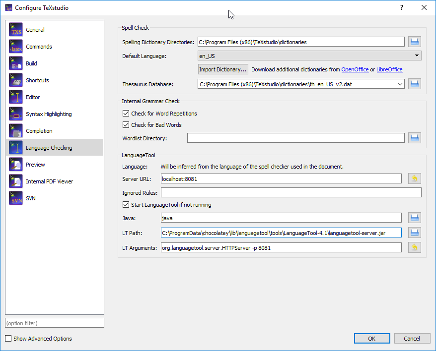
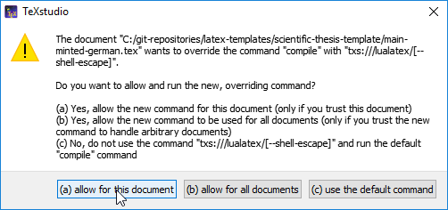
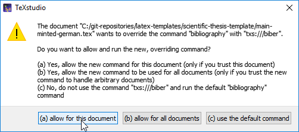

# Recommended LaTeX environments

## TeXStudio as LaTeX Editor

Grammar and spell checking is available at [TeXstudio].
Please download [LanguageTool] and [configure TeXstudio to use it](http://wiki.languagetool.org/checking-la-tex-with-languagetool#toc4).
Note that it is enough to point to `languagetool-server.jar`.

The template is compiled using normal compilation commands.
Your LaTeX environment (such as [TeXStudio]) should take care about the compilation transparently.

If you open `main-minted-german.tex`, there will be a warning that the compilation command will be overridden.
Please answer `(a) allow for this document`:

At "Build & View", there will be a question to update to biber.
Please answer `(a) allow for this document`:

When the "Package Installation" dialog pops up at TeXStudio, choose your username at "The package will be installed for:" and uncheck "Always show this dialog before installing packages."
If you want to include .svg graphics, [inkscape] has to be in your path.

**Attention!** The first compilation will take **at least 30 seconds**, because there will be some LaTeX packages installed.

**If TeXstudio doesn't fit your need, check [the list of all available LaTeX Editors](http://tex.stackexchange.com/questions/339/latex-editors-ides).**

## JabRef for managing literature

Use [JabRef] to manage your bibliography.
Quick installation using [Chocolatey]: `choco install texstudio languagetool jabref`.

A comparison to other literature management software is available at <https://ultimate-comparisons.github.io/ultimate-reference-management-software-comparison/>.
See [LaTeX Editors/IDEs question on TeX.SX](http://tex.stackexchange.com/questions/339/latex-editors-ides) for a complete list of LaTeX editors.

## Installation hints for Ubuntu

- From Ubuntu 18.10 onwards, the basic version of the template works without issues.
  Advanced usages such as cool syntax highlighting with [minted](https://www.ctan.org/pkg/minted) needs more configuration.
- Ubuntu 16.04 [ships biber 2.4](https://bugs.launchpad.net/ubuntu/+source/biber/+bug/1589644), so you have to upgrade your texlive distribution.
  The easiest way is to uninstall the ubuntu package and use [install-tl-ubuntu](https://github.com/scottkosty/install-tl-ubuntu).
  Then, you can follow the instructions given at <http://tex.stackexchange.com/a/55459/9075> to update your texlive distribution.
  If you do not want to have an updated installation, but fiddle around with dirty patching your installation, please follow  <http://tex.stackexchange.com/questions/84624/how-to-upgrade-biblatex-properly>.

Always working solution: Use the [docker image](https://gitlab.com/islandoftex/images/texlive#tex-live-docker-image).
This provides a perfectly configured latex distribution with all required tools.

1. Execute `sudo visudo` to edit the sudoers file
1. Add the line `myusername ALL = (root) NOPASSWD: /usr/bin/docker`. Replace `myusername` accordingly. (Source: <https://unix.stackexchange.com/a/13058/18033>)
1. Execute `sudo docker pull registry.gitlab.com/islandoftex/images/texlive:latest`.
   This should not ask for any password.
   Will download approx. 4GB.
1. Open TeXstudio
1. Options > Configure TeXstudio > Commands
1. Set "PdfLaTeX" to `docker run --rm -v DIROFTEXDOCUMENT:DIROFTEXDOCUMENT --workdir=DIROFTEXDOCUMENT registry.gitlab.com/islandoftex/images/texlive:latest pdflatex --shell-escape -synctex=1 -interaction=nonstopmode %.tex`, replace `DIROFTEXDOCUMENT` by the directory of your latex document. Example: `/home/user/thesis`.
1. Set "LuaLaTeX" to `docker run --rm -v DIROFTEXDOCUMENT:DIROFTEXDOCUMENT --workdir=DIROFTEXDOCUMENT registry.gitlab.com/islandoftex/images/texlive:latest lualatex --shell-escape -synctex=1 -interaction=nonstopmode %.tex`, replace `DIROFTEXDOCUMENT` by the directory of your latex document. Example: `/home/user/thesis`.
1. Set "Biber" to `docker run --rm -v DIROFTEXDOCUMENT:DIROFTEXDOCUMENT --workdir=DIROFTEXDOCUMENT registry.gitlab.com/islandoftex/images/texlive:latest biber %`, replace `DIROFTEXDOCUMENT` by the directory of your latex document. Example: `/home/user/thesis`.
1. Check if the "docker pull" command from step 3 succeed. If not, wait.
1. Try to press the "Compile" (<kbd>F6</kbd>) button in TeXstudio.

## Installation hints for Windows

Note: The default installation of MiKTeX might ship with incompatible biblatex and biber packages.
**You have to keep your MiKTeX up to date.**
In case you followed the linked installation steps, you only have to run "Update MiKTeX".
If you installed MiKTeX other ways, you have to run "Update MiKTeX (Admin)" and "Update MiKTeX" and check in both tools for updates (see <http://tex.stackexchange.com/a/108490/9075>).
  
### Preparations

1. Install [chocolatey]:
    1. Open `cmd.exe` as Administartor
    2. Paste and hit <kbd>Enter</kbd> `@"%SystemRoot%\System32\WindowsPowerShell\v1.0\powershell.exe" -NoProfile -InputFormat None -ExecutionPolicy Bypass -Command "iex ((New-Object System.Net.WebClient).DownloadString('https://chocolatey.org/install.ps1'))" && SET "PATH=%PATH%;%ALLUSERSPROFILE%\chocolatey\bin"`
1. Execute `choco feature enable -n=allowGlobalConfirmation` to get rid off additional installation confirmations.
1. Execute `choco install texstudio sumatrapdf.install strawberryperl jre8 jabref languagetool` to install necessary tooling.
1. In case [PlantUML](http://plantuml.com/) should be used, follow the installation instructions at <https://koppor.github.io/plantuml/> listed at the "pre-conditions" section.
1. For more recommended tooling see <https://github.com/koppor/koppors-chocolatey-scripts>.

### Recommended setup of MiKTeX

1. Download the basic installer from <http://miktex.org/download>
1. Start it
1. First screen: Read the license conditions and be sure that you really agree.
    - Check "I accept the MiKTeX copying conditions"
    - Click "Next"
1. Second screen: "Shared Installation": Install MiKTeX for: "Only for: `username`".
    - Check first option
    - Click "Next"
1. Third screen: "Installation Directory": Install MiKTeX to: `C:\MiKTeX`. This enabled browsing for documentation at `C:\MiKTeX29\doc\latex`
    - Input "C:\MiKTeX" in the input field
    - Click "Next"
1. Fourth screen: "Settings": Preferred paper: A4 and install missing packages on the fly.
    - First combo box: "A4"
    - Second combo box: "Yes":
    - Click "Next"
1. Fifth screen: Press "Start"
1. Now a window "Executing" appears. It will take about 5 minutes until this is finished.
1. At the last screen: Click "Close"
1. After the installation:
     1. Open `cmd.exe`
     2. Execute `refreshenv` to make MiKTeX's binaries known right after the installation
     3. Execute `mpm --update-db`
     4. Execute `mpm --update`
     5. Execute `mpm --install=tex-gyre` (to resolve `fontspec error: "font-not-found"`, `\setmainfont{TeX Gyre Termes}`)
     6. Execute `mpm --install=tex-gyre-math`
     7. Execute `mpm --install=cm-super`
     8. Execute `initexmf --update-fndb` (ensure that no other MiKTeX tooling such as the [MiKTeX Console](https://miktex.org/howto/miktex-console) is run in parallel - see <https://github.com/MiKTeX/miktex/issues/98#issuecomment-375952270>)
     9. Execute `initexmf --mklinks --force`

[chocolatey]: https://chocolatey.org/
[JabRef]: https://www.jabref.org
[LanguageTool]: https://languagetool.org/
[TeXstudio]: http://texstudio.sourceforge.net/
