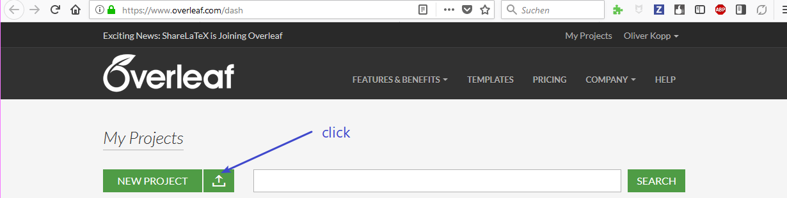
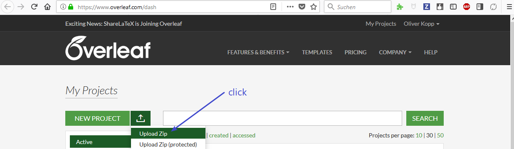
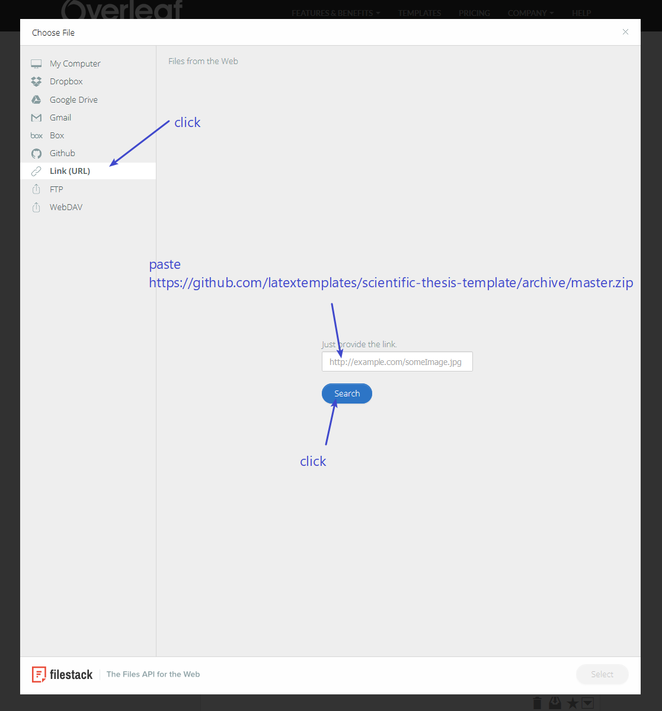
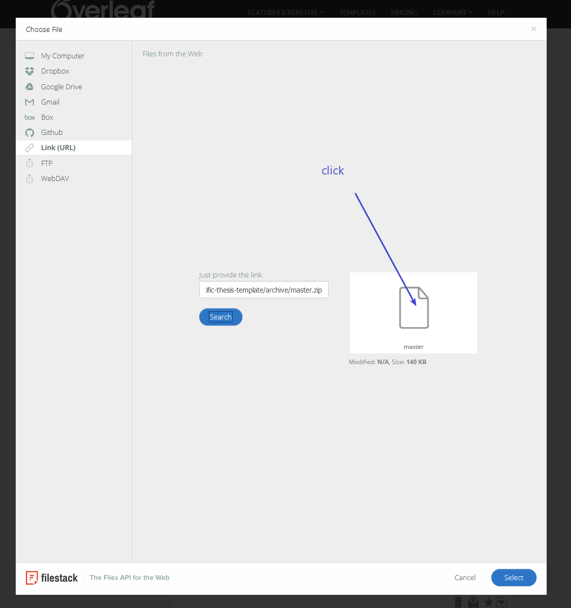
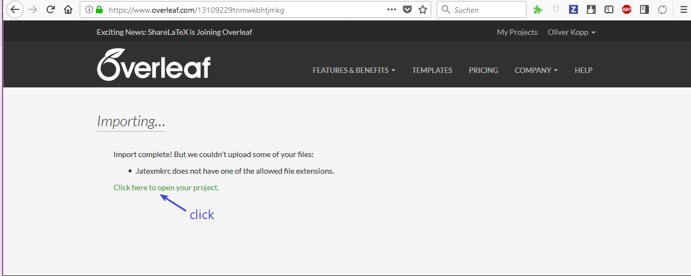
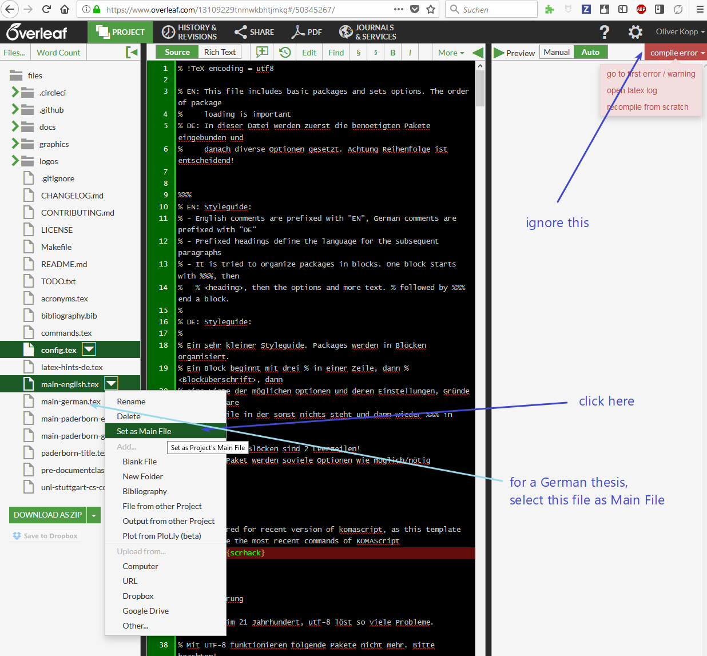
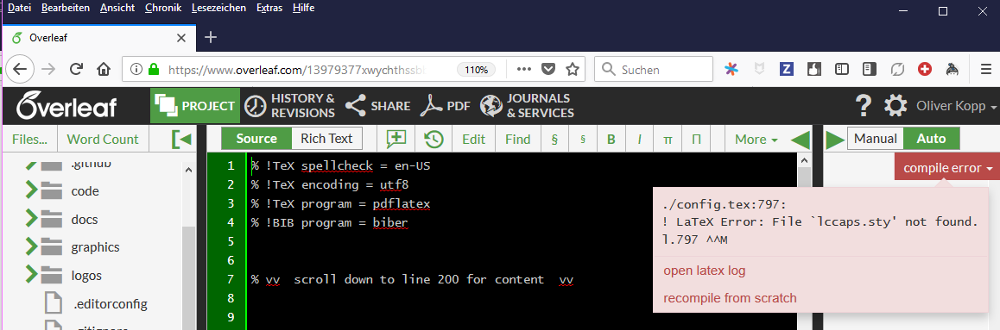
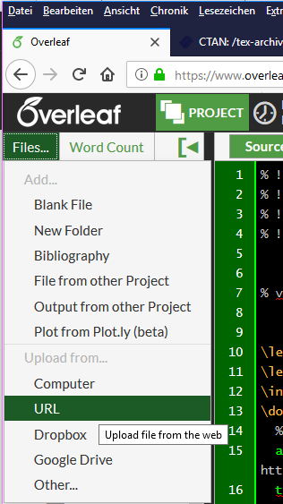
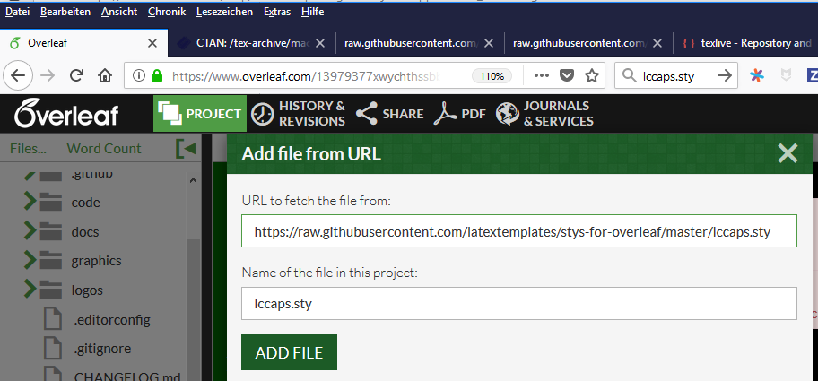

# Usage at overleaf

<!-- toc -->

- [Automatic setup](#automatic-setup)
- [Manual setup](#manual-setup)

<!-- tocstop -->

## Automatic setup

1. Sign in at overleaf and click on "upload new project"  
   

2. Choose "Upload Zip"  
   

3. Select <https://github.com/latextemplates/scientific-thesis-template/archive/master.zip> for uploading  
   

4. Upload master.zip  
   

5. Ignore import error of `.latexmkrc`  
  

6. Choose main file: For English, choose `main-english.tex`. For German, choose `main-german.tex`.  
  

7. See error missing `sty` files.  
  You get following error:  
    
  The Overleaf FAQ states at [What packages do you support?](https://www.overleaf.com/help/30-what-packages-do-you-support) that they support TeX Live 2016, which does not include all new packages.
  The templates makes use of two packages, which are not included at overleaf until now.
  Thus, you have to upload the sty files manually.

8. Upload `llcaps.sty`  
    
  Insert the URL <https://raw.githubusercontent.com/latextemplates/stys-for-overleaf/master/lccaps.sty>  
  

9. Upload `scientific-thesis-cover.sty`  
   Similar as `llcaps.sty`. Use <https://raw.githubusercontent.com/latextemplates/scientific-thesis-cover/master/scientific-thesis-cover.sty> as URL.

10. ~~Switch build tool to lualatex.~~
    LuaLaTeX is currently not working on Overleaf.
    You have to wait for an overleaf update.
    ~~Choose lualatex in project settings as outlined at <https://www.overleaf.com/blog/167-new-build-options-available-on-writelatex-compile-with-lualatex-or-latex-plus-dvipdf#.WqE7rOdG3kY>.~~
    <!--  -->

11. Now you can start working in the main file.

## Manual setup

1. create new overleaf project
2. clone the overleaf project using git
3. copy the files to that directory. Follow the steps at "Download" above
4. delete `.latexmkrc`
5. `git add .`
6. `git commit -m"initial import"`
7. `git push`
